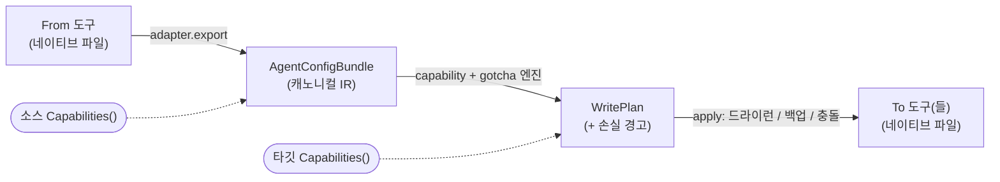

<div align="center">

# 🔄 agensync

### 설정 하나로, 모든 AI 코딩 에이전트를.

**AI 코딩 에이전트 설정 — 지침(instructions), MCP 서버, 스킬, 커맨드, 서브에이전트, 그리고 개인 메모리까지 — 를 Claude Code · Codex · Cursor · Gemini CLI 외 6종 사이에서 복제·이관합니다.**

[](https://pkg.go.dev/github.com/YangTaeyoung/agensync)
[](https://goreportcard.com/report/github.com/YangTaeyoung/agensync)
[](https://github.com/YangTaeyoung/agensync/actions)
[](https://github.com/YangTaeyoung/agensync/releases)
[](go.mod)
[](LICENSE)

[English](./README.md) · **한국어**

</div>

---

**Claude Code**에서 컨벤션·MCP 서버·스킬을 한 번 세팅했는데, 동료는 **Cursor**를 쓰고 CI는 **Codex**를 돌리고, 나는 **Gemini CLI**도 시험해 보는 중이라면? `agensync`가 그 경험을 모든 도구로 **비파괴적으로** 옮겨줍니다.

```console
$ agensync migrate --from claude-code --to codex,cursor --apply

Plan for codex:
  + AGENTS.md (new file, 412 bytes)
  + .codex/config.toml (new file, 198 bytes)
  + .env (new file, 64 bytes)
  warn: [mcp] claude-code→codex "figma": manual (inline secret externalized to env var FIGMA_TOKEN)
Plan for cursor:
  + AGENTS.md (new file, 412 bytes)
  + .cursor/mcp.json (new file, 233 bytes)

applied to codex: 3 written, 1 backed up, 0 skipped
applied to cursor: 2 written, 0 backed up, 0 skipped
  → Codex: grant trust for this folder before first run
```

## ✨ agensync를 쓰는 이유

- 🧠 **중요한 건 다 옮깁니다** — 지침, MCP 서버, 스킬, 커맨드, 서브에이전트, 프로젝트 권한/훅/신뢰(trust), 그리고 **개인·글로벌 메모리**까지.
- 🗂️ **두 개의 레이어** — 프로젝트 로컬 파일은 물론, 도구가 홈 디렉터리에 프로젝트별로 저장하는 설정(예: `~/.claude.json`)까지.
- 🔐 **시크릿 안전** — 인라인 API 토큰을 **절대** 평문으로 다시 기록하지 않고, 환경변수 참조 + `.env` 스텁으로 외부화합니다.
- 🚨 **조용히 버리지 않음** — 타깃이 표현할 수 없는 항목은 반드시 구조화된 경고로 리포트에 남깁니다. 전 어댑터를 검사하는 상시 테스트로 보장.
- 🧪 **기본은 드라이런** — 무엇이든 기록하기 전에 전체 diff + 손실 리포트를 미리보기로 확인. 모든 덮어쓰기는 `.bak`으로 백업.
- 🎛️ **대화형 또는 스크립트** — Bubble Tea TUI, 또는 CI용 완전 플래그 기반 비대화형 모드.
- 🧩 **도구별 어댑터** — 공용 캐노니컬 IR을 사용하므로, N×N 변환기가 아니라 어댑터 추가만으로 커버리지가 늘어납니다.

## 🚀 설치

```bash
go install github.com/YangTaeyoung/agensync/cmd/agensync@latest
```

…또는 [최신 릴리즈](https://github.com/YangTaeyoung/agensync/releases/latest)에서 미리 빌드된 바이너리를 받으세요. 소스 빌드에는 Go 1.26+ 가 필요합니다.

## ⚡ 빠른 시작

```bash
# 1. 현재 위치에 어떤 도구가 설정돼 있는지 확인
agensync detect

# 2. 마이그레이션 미리보기 (기본이 드라이런 — 아무것도 기록 안 함)
agensync migrate --from claude-code --to codex

# 3. 실제 적용 (.bak 백업 자동 생성)
agensync migrate --from claude-code --to codex,cursor --apply

# 4. 또는 그냥 대화형으로 실행
agensync
```

<div align="center">

`From` → `To (다중 선택)` → `카테고리` → **플랜 미리보기 + 손실 리포트** → 충돌별 선택 → **적용**

</div>

## 🧰 지원 도구

| 도구 | `id` | 등급 | 비고 |
|---|---|:--:|---|
| Claude Code | `claude-code` | 🟢 높음 | 표준 소스 — `~/.claude.json` 2-레이어 |
| Codex CLI | `codex` | 🟢 높음 | JSON/MD → TOML, 환경변수 간접 시크릿 |
| Kiro | `kiro` | 🟢 높음 | `inclusion` 스티어링, `#[[file:]]` 임베드 |
| GitHub Copilot | `copilot` | 🟢 높음 | CLI 표면, `.agent.md`, `applyTo` glob |
| Cursor | `cursor` | 🟢 높음 | `.mdc` 규칙, User-Rules 붙여넣기 안내 |
| Gemini CLI | `gemini-cli` | 🟢 높음 | TOML 커맨드, `httpUrl` MCP |
| Antigravity | `antigravity` | 🟡 중간 | 퍼지 경로, `serverUrl`, 주석 제거 |
| Windsurf / Devin | `windsurf` | 🟡 중간 | 글로벌 전용 MCP, 글자 수 제한 |
| Cline | `cline` | 🟡 중간 | 글로벌 전용 MCP, `/name.md` 워크플로 |
| Aider | `aider` | 🔵 제한적 | 지침 전용 타깃 |

*등급 = 포맷 안정성/신뢰도. 중간 등급 어댑터는 퍼지 경로 매칭 + 폴백을 사용합니다.*

## 🧠 개인 메모리

글로벌 메모리(예: `~/.claude/CLAUDE.md`)도 함께 따라갑니다. agensync는 이를 유저 스코프 지침으로 모델링하고, `memory` 카테고리를 통해 각 도구의 글로벌 메모리 파일에 기록합니다.

```bash
agensync migrate --from claude-code --to codex,gemini-cli --only memory --apply
# ~/.claude/CLAUDE.md → ~/.codex/AGENTS.md + ~/.gemini/GEMINI.md
```

메모리가 불투명하거나 UI에만 존재하는 경우(Cursor User Rules, Windsurf 자동 메모리, Aider)에는, 내용을 버리지 않고 **경고와 함께 수동 붙여넣기용으로 보존**합니다.

## 🛡️ 안전성

| 보장 | 방식 |
|---|---|
| **기본 드라이런** | 기록은 `--apply`/`--yes` 또는 대화형 확인이 있어야만 수행 |
| **백업** | 덮어쓰기 시 `<file>.bak` 생성. 다중 타깃 실행에서도 *원본*을 보존 |
| **평문 시크릿 금지** | 인라인 토큰 → 환경변수 참조 + `.env` 스텁 + 경고 (상시 누출 테스트로 강제) |
| **신뢰(trust) 안내** | 신뢰되지 않은 폴더를 무시하는 도구에는 "trust 부여" 단계를 명시 |
| **조용히 버리지 않음** | 표현 불가능한 모든 카테고리 → 리포트에 구조화된 경고 1건 |

## 🏗️ 동작 원리

모든 도구는 공용 캐노니컬 IR(`AgentConfigBundle`)로/에서 매핑됩니다. 그래서 도구쌍별 변환기가 아니라 어댑터만 있으면 됩니다.



<details>
<summary><b>CLI 레퍼런스</b></summary>

```text
agensync detect                       프로젝트 + 홈에서 감지된 도구 나열
agensync migrate [flags]              한 도구에서 하나 이상의 도구로 이관
agensync                              대화형 TUI

플래그:
  --from <id>                         소스 도구
  --to <ids>                          쉼표로 구분된 타깃
  --only <cats> / --skip <cats>       카테고리 필터
  --dry-run                           플랜만 (기본)
  --apply, --yes                      파일 기록
  --on-conflict skip|overwrite|merge|suffix
  --no-backup                         .bak 파일 생성 안 함
  --home <dir> / --project <dir>      경로 재정의
  --report <path>                     마이그레이션 리포트 기록
```

**카테고리:** `instructions` · `mcp` · `skills` · `commands` · `subagents` · `project-state` · `memory`

</details>

## 🤝 기여하기

도구 추가 = 어댑터 추가입니다. `internal/adapter/<tool>/`에 `ToolAdapter` 인터페이스를 구현하고, 정직한 `Capabilities()`를 선언한 뒤, 골든 파일 테스트를 추가하세요. 레퍼런스 어댑터(`claudecode`, `codex`)가 두 가지 패턴(네이티브 MD/JSON, 포맷 변환)을 보여줍니다.

```bash
go test ./...
go vet ./...
```

## 📄 라이선스

[MIT](LICENSE) © [YangTaeyoung](https://github.com/YangTaeyoung)

---

<div align="center">
<sub>Go · cobra · bubbletea · go-toml · goccy/go-yaml 로 제작</sub>
</div>
