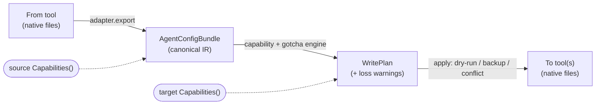

<div align="center">

# 🔄 agensync

### One config. Every AI coding agent.

**Clone or migrate your AI-coding-agent setup — instructions, MCP servers, skills, commands, subagents, and personal memory — between Claude Code, Codex, Cursor, Gemini CLI, and 6 more.**

[](https://pkg.go.dev/github.com/YangTaeyoung/agensync)
[](https://goreportcard.com/report/github.com/YangTaeyoung/agensync)
[](https://github.com/YangTaeyoung/agensync/actions)
[](https://github.com/YangTaeyoung/agensync/releases)
[](go.mod)
[](LICENSE)

**English** · [한국어](./README.ko.md)

</div>

---

You set up your conventions, MCP servers, and skills once in (say) **Claude Code** — then your teammate uses **Cursor**, your CI uses **Codex**, and you're trying **Gemini CLI** on the side. `agensync` carries the same experience across all of them, **non-destructively**.

```console
$ agensync migrate --from claude-code --to codex,cursor --apply

Plan for codex:
  + AGENTS.md (new file, 412 bytes)
  + .codex/config.toml (new file, 198 bytes)
  + .env (new file, 64 bytes)
  warn: [mcp] claude-code→codex "figma": manual (inline secret externalized to env var FIGMA_TOKEN)
Plan for cursor:
  + AGENTS.md (new file, 412 bytes)
  + .cursor/mcp.json (new file, 233 bytes)

applied to codex: 3 written, 1 backed up, 0 skipped
applied to cursor: 2 written, 0 backed up, 0 skipped
  → Codex: grant trust for this folder before first run
```

## ✨ Why agensync

- 🧠 **Migrates everything that matters** — instructions, MCP servers, skills, commands, subagents, project permissions/hooks/trust, and **personal/global memory**.
- 🗂️ **Two layers** — both project-local files *and* the per-project settings tools stash in your home dir (e.g. `~/.claude.json`).
- 🔐 **Secret-safe** — inline API tokens are **never** re-serialized as plaintext; they're externalized to an env-var reference + a `.env` stub.
- 🚨 **Never silently drops** — anything a target can't represent produces one structured warning in the migration report. Guaranteed by a standing test across every adapter.
- 🧪 **Dry-run by default** — preview a full diff + loss report before anything is written; every overwrite is backed up to `.bak`.
- 🎛️ **Interactive or scripted** — a Bubble Tea TUI, or fully-flagged non-interactive flags for CI.
- 🧩 **Adapter-per-tool** — a shared canonical IR means coverage grows by adding adapters, not N×N converters.

## 🚀 Install

```bash
go install github.com/YangTaeyoung/agensync/cmd/agensync@latest
```

…or grab a prebuilt binary from the [latest release](https://github.com/YangTaeyoung/agensync/releases/latest). Requires Go 1.26+ to build from source.

## ⚡ Quickstart

```bash
# 1. See which tools are configured here
agensync detect

# 2. Preview a migration (dry-run is the default — writes nothing)
agensync migrate --from claude-code --to codex

# 3. Apply it (with automatic .bak backups)
agensync migrate --from claude-code --to codex,cursor --apply

# 4. Monorepo? Resolve the .git root and migrate every nested project in place
agensync migrate --from claude-code --to gemini-cli --recursive --apply

# 5. Or just run it interactively
agensync
```

> **Recursive mode** (`-r`/`--recursive`) walks up to your `.git` root, then migrates every nested directory that has source config (e.g. `services/api/CLAUDE.md` → `services/api/AGENTS.md`). Dependency/VCS/hidden dirs (`node_modules`, `.git`, `.claude`, …) are skipped; the home-dir memory layer is migrated once.

<div align="center">

**Detected tools** → `From` → `To (multi-select)` → `Categories` → `Options: overwrite? recurse?` → **Plan preview + loss report** → **Apply + progress**

</div>

The interactive flow shows which tools are detected in the current project, lets you pick **From**/**To**, toggle **Overwrite** (existing files; `.bak` backups always kept) and **Recurse into subdirectories** (monorepo), then previews exactly what will change before you confirm. `↑/↓` move · `space` toggle · `enter` next · `esc` back · `q` quit.

## 🧰 Supported tools

| Tool | `id` | Tier | Notes |
|---|---|:--:|---|
| Claude Code | `claude-code` | 🟢 high | canonical source — `~/.claude.json` two-layer |
| Codex CLI | `codex` | 🟢 high | JSON/MD → TOML, env-indirect secrets |
| Kiro | `kiro` | 🟢 high | `inclusion` steering, `#[[file:]]` embeds |
| GitHub Copilot | `copilot` | 🟢 high | CLI surface, `.agent.md`, `applyTo` globs |
| Cursor | `cursor` | 🟢 high | `.mdc` rules, User-Rules paste-in |
| Gemini CLI | `gemini-cli` | 🟢 high | TOML commands, `httpUrl` MCP |
| Antigravity | `antigravity` | 🟡 medium | fuzzy paths, `serverUrl`, no comments |
| Windsurf / Devin | `windsurf` | 🟡 medium | global-only MCP, char caps |
| Cline | `cline` | 🟡 medium | global-only MCP, `/name.md` workflows |
| Aider | `aider` | 🔵 limited | instructions-only target |

*Tier = format stability/confidence. Medium-tier adapters use fuzzy path matching + fallbacks.*

## 🧠 Personal memory

Your global memory (e.g. `~/.claude/CLAUDE.md`) travels with you. agensync models it as user-scope instructions and writes it to each tool's global memory file via the `memory` category:

```bash
agensync migrate --from claude-code --to codex,gemini-cli --only memory --apply
# ~/.claude/CLAUDE.md → ~/.codex/AGENTS.md + ~/.gemini/GEMINI.md
```

Where memory is opaque or UI-only (Cursor User Rules, Windsurf auto-memories, Aider), agensync **warns and preserves the content for manual paste-in** instead of dropping it.

## 🛡️ Safety

| Guarantee | How |
|---|---|
| **Dry-run by default** | writes require `--apply`/`--yes` or interactive confirmation |
| **Backups** | every overwrite → `<file>.bak`; the *original* is preserved even across multi-target runs |
| **No plaintext secrets** | inline tokens → env-var reference + `.env` stub + warning (enforced by a standing leak test) |
| **Trust gating** | tools that ignore untrusted folders get an explicit "grant trust" step |
| **Never silently drop** | every unrepresentable category → one structured warning in the report |

## 🏗️ How it works

Every tool maps to/from a shared canonical IR (`AgentConfigBundle`), so there are no pairwise converters — just adapters.



<details>
<summary><b>CLI reference</b></summary>

```text
agensync detect                       list tools detected in project + home
agensync migrate [flags]              migrate from one tool to one or more others
agensync                              interactive TUI

Flags:
  --from <id>                         source tool
  --to <ids>                          comma-separated targets
  --only <cats> / --skip <cats>       category filter
  --dry-run                           plan only (default)
  --apply, --yes                      write files
  --on-conflict skip|overwrite|merge|suffix
  --no-backup                         don't write .bak files
  -r, --recursive                     resolve the project root (.git) and migrate every nested project in place
  --home <dir> / --project <dir>      override resolved paths
  --report <path>                     write the migration report
```

**Categories:** `instructions` · `mcp` · `skills` · `commands` · `subagents` · `project-state` · `memory`

</details>

## 🤝 Contributing

Adding a tool = adding an adapter. Implement the `ToolAdapter` interface in `internal/adapter/<tool>/`, declare honest `Capabilities()`, and add golden-file tests. The reference adapters (`claudecode`, `codex`) show the two patterns: native MD/JSON and format-transform.

```bash
go test ./...
go vet ./...
```

## 📄 License

[MIT](LICENSE) © [YangTaeyoung](https://github.com/YangTaeyoung)

---

<div align="center">
<sub>Built with Go · cobra · bubbletea · go-toml · goccy/go-yaml</sub>
</div>
